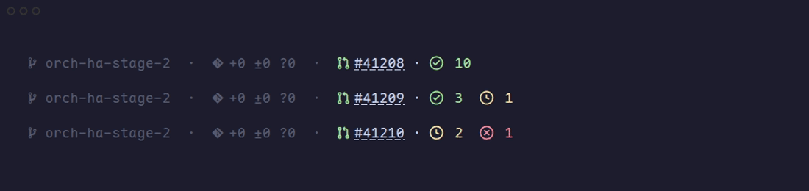
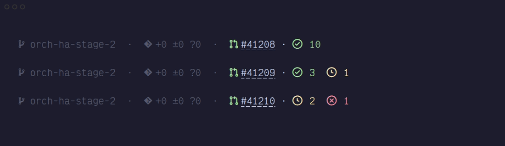

# pi-gh-footer

Compact PR status for [Pi](https://github.com/badlogic/pi-mono) + [pi-footer](https://www.npmjs.com/package/pi-footer): ` #41208 ·   3    1`. Nerd Font glyphs, colored passed/running/failed indicators (only nonzero states appear), and an OSC 8 link on **only** the PR number.

Maple Mono NF:



Victor Mono Nerd Font:



Requires `git`, authenticated `gh`, a Nerd Font, and an OSC 8-capable terminal.

```sh
pi install npm:pi-footer
pi install git:github.com/championswimmer/pi-gh-footer
```

Disable `pi-pr-status` if installed (it writes the same status key); reload Pi. In `/footer`, choose **one** of:

- **Extension Status**: `externalStatusKey: "pr-status"` — complete summary, compatible with existing footer config. Use `fg: "default"`, no extra icon.
- **Event Value**: set `widgetId` to any ID below and arrange/style widgets in pi-footer. Events use `pi-footer:update-widget` with `{ widgetId, value: string | null }`; missing PRs clear values.

| Event widget ID | Value |
| --- | --- |
| `gh-pr` | complete colored summary |
| `gh-pr-number` | linked `#41208` |
| `gh-pr-state-icon` / `gh-pr-state` | colored PR icon / `open`, `merged`, `closed` |
| `gh-pr-checks` | colored check-circle / clock / x-circle + counts |
| `gh-pr-passed` / `gh-pr-running` / `gh-pr-failed` | nonzero counts (otherwise cleared), for custom icons/colors |
| `gh-pr-repo` / `gh-pr-title` | repository / title |

Example custom widgets: `gh-pr-number` with icon ` `, then the three raw counts with icons ` `, ` `, ` ` and foregrounds green/yellow/red. The current branch's PR takes priority; otherwise a PR URL in user input is used. Updates every 30 seconds.

Development: `npm ci && npm test && npm run typecheck`. Screenshots: `vhs demo/maple-mono.tape` / `vhs demo/victor-mono.tape` (from repo root; install the named fonts first).
